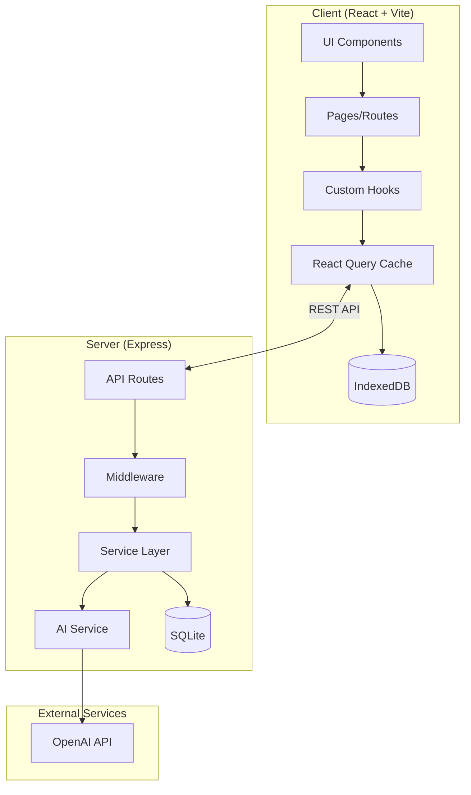
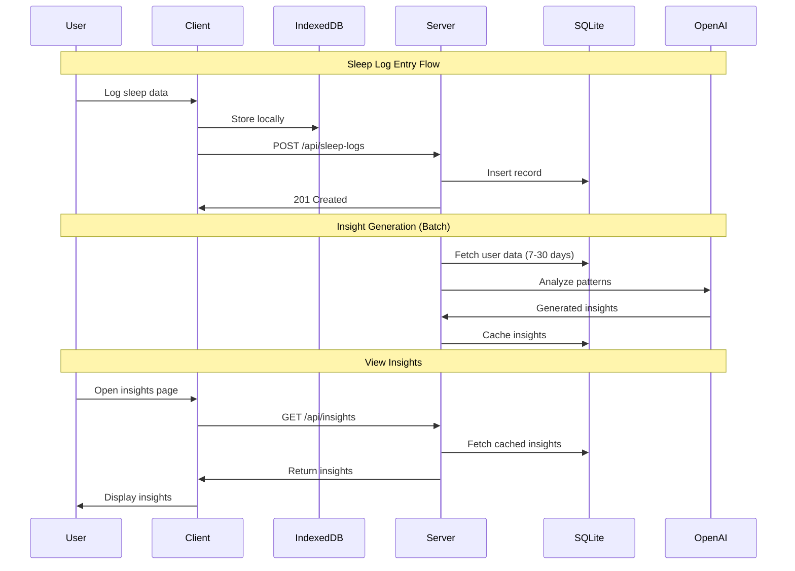

# Architecture: Sleep Tracker & Wellness Diary

## System Overview

A personal wellness application that tracks sleep patterns and maintains a daily wellness diary with AI-powered insights. The system enables users to log sleep data (bedtime, wake time, quality, interruptions) and daily wellness entries (mood, energy, activities, diet), then analyzes this data to surface patterns, correlations, and actionable recommendations.

**Core Goals:**
- Provide frictionless logging experience optimized for mobile (morning/bedtime use)
- Securely store and persist personal wellness data
- Generate meaningful AI-driven insights from accumulated data
- Visualize trends and patterns over time
- Work offline with background sync capability

## Technology Stack

- **Language**: TypeScript (full-stack)
- **Frontend Framework**: React 18 with Vite
- **Styling**: Tailwind CSS
- **Backend Framework**: Node.js with Express.js
- **Database**: SQLite with better-sqlite3 (migration path to PostgreSQL)
- **ORM**: Drizzle ORM (lightweight, TypeScript-native)
- **Authentication**: JWT with bcrypt password hashing
- **AI Integration**: OpenAI API (GPT-4o-mini for cost efficiency)
- **Charts**: Recharts (React-native charting)
- **Testing**: Vitest (unit), Playwright (E2E)
- **Validation**: Zod (shared schemas between client/server)
- **HTTP Client**: Axios with interceptors for auth
- **State Management**: React Query (TanStack Query) for server state
- **Offline Storage**: IndexedDB via Dexie.js

## System Architecture

The application follows a **Monolithic Monorepo** pattern with clear separation between client and server. The architecture prioritizes:

1. **Offline-First**: Core functionality works without network; data syncs when online
2. **Progressive Enhancement**: Base features work without AI; insights are additive
3. **API-First Design**: Clean REST contracts enable future mobile apps
4. **Batch AI Processing**: Insights generated on schedule to control costs

### Component Diagram (Mermaid)



### Data Flow Diagram



## File Structure

```
Sleep_Tracker___Well_20251209_215338-n2m/
├── client/
│   ├── src/
│   │   ├── components/
│   │   │   ├── ui/                    # Reusable UI primitives
│   │   │   │   ├── Button.tsx
│   │   │   │   ├── Input.tsx
│   │   │   │   ├── Card.tsx
│   │   │   │   ├── Modal.tsx
│   │   │   │   └── Spinner.tsx
│   │   │   ├── forms/                 # Form components
│   │   │   │   ├── SleepLogForm.tsx
│   │   │   │   ├── DiaryEntryForm.tsx
│   │   │   │   └── LoginForm.tsx
│   │   │   ├── charts/                # Data visualization
│   │   │   │   ├── SleepTrendChart.tsx
│   │   │   │   ├── QualityChart.tsx
│   │   │   │   └── MoodCorrelation.tsx
│   │   │   ├── insights/              # AI insight display
│   │   │   │   ├── InsightCard.tsx
│   │   │   │   └── InsightsList.tsx
│   │   │   └── layout/                # Layout components
│   │   │       ├── Header.tsx
│   │   │       ├── BottomNav.tsx
│   │   │       └── AppShell.tsx
│   │   ├── pages/
│   │   │   ├── Dashboard.tsx          # Main landing/overview
│   │   │   ├── SleepLog.tsx           # Sleep entry page
│   │   │   ├── Diary.tsx              # Wellness diary page
│   │   │   ├── Insights.tsx           # AI insights page
│   │   │   ├── History.tsx            # Historical data view
│   │   │   ├── Login.tsx              # Auth page
│   │   │   ├── Register.tsx           # Registration page
│   │   │   └── Settings.tsx           # User settings
│   │   ├── hooks/
│   │   │   ├── useSleepLogs.ts        # Sleep data queries/mutations
│   │   │   ├── useDiaryEntries.ts     # Diary data queries/mutations
│   │   │   ├── useInsights.ts         # Insights queries
│   │   │   ├── useAuth.ts             # Auth state management
│   │   │   └── useOfflineSync.ts      # Offline data sync
│   │   ├── lib/
│   │   │   ├── api.ts                 # Axios instance + interceptors
│   │   │   ├── db.ts                  # Dexie IndexedDB setup
│   │   │   ├── auth.ts                # Auth utilities
│   │   │   └── utils.ts               # Helper functions
│   │   ├── types/
│   │   │   └── index.ts               # Shared TypeScript types
│   │   ├── App.tsx                    # Root component + routing
│   │   ├── main.tsx                   # Entry point
│   │   └── index.css                  # Tailwind imports
│   ├── public/
│   │   └── manifest.json              # PWA manifest
│   ├── index.html
│   ├── vite.config.ts
│   ├── tailwind.config.js
│   ├── tsconfig.json
│   └── package.json
├── server/
│   ├── src/
│   │   ├── routes/
│   │   │   ├── auth.ts                # POST /auth/register, /auth/login
│   │   │   ├── sleepLogs.ts           # CRUD /api/sleep-logs
│   │   │   ├── diaryEntries.ts        # CRUD /api/diary-entries
│   │   │   └── insights.ts            # GET /api/insights
│   │   ├── models/
│   │   │   ├── schema.ts              # Drizzle schema definitions
│   │   │   └── migrations/            # Database migrations
│   │   ├── services/
│   │   │   ├── sleepService.ts        # Sleep business logic
│   │   │   ├── diaryService.ts        # Diary business logic
│   │   │   ├── insightService.ts      # Insight generation logic
│   │   │   └── aiService.ts           # OpenAI integration
│   │   ├── middleware/
│   │   │   ├── auth.ts                # JWT verification
│   │   │   ├── validation.ts          # Zod validation middleware
│   │   │   └── errorHandler.ts        # Global error handling
│   │   ├── jobs/
│   │   │   └── insightGenerator.ts    # Scheduled insight batch job
│   │   ├── lib/
│   │   │   ├── db.ts                  # Database connection
│   │   │   └── openai.ts              # OpenAI client setup
│   │   └── index.ts                   # Server entry point
│   ├── drizzle.config.ts
│   ├── tsconfig.json
│   └── package.json
├── shared/
│   ├── schemas/                       # Zod schemas (shared validation)
│   │   ├── sleepLog.ts
│   │   ├── diaryEntry.ts
│   │   └── user.ts
│   └── package.json
├── package.json                       # Root workspace config
├── .env.example
├── .gitignore
└── README.md
```

## Module Specifications

### Module: Authentication (server/src/routes/auth.ts)
**Responsibility**: User registration, login, JWT token management
**Key Files**:
- `server/src/routes/auth.ts`
- `server/src/middleware/auth.ts`
- `client/src/hooks/useAuth.ts`
**Dependencies**: bcrypt, jsonwebtoken, Zod
**Interfaces**:
```typescript
POST /auth/register
  Body: { email: string, password: string, name: string }
  Response: { user: User, token: string }

POST /auth/login
  Body: { email: string, password: string }
  Response: { user: User, token: string }

GET /auth/me
  Headers: Authorization: Bearer <token>
  Response: { user: User }
```

### Module: Sleep Logging (server/src/routes/sleepLogs.ts)
**Responsibility**: CRUD operations for sleep log entries
**Key Files**:
- `server/src/routes/sleepLogs.ts`
- `server/src/services/sleepService.ts`
- `client/src/hooks/useSleepLogs.ts`
- `client/src/components/forms/SleepLogForm.tsx`
**Dependencies**: Drizzle ORM, Zod validation
**Interfaces**:
```typescript
GET /api/sleep-logs
  Query: { startDate?: string, endDate?: string, limit?: number }
  Response: { logs: SleepLog[] }

POST /api/sleep-logs
  Body: {
    date: string,           // ISO date YYYY-MM-DD
    bedtime: string,        // ISO datetime
    wakeTime: string,       // ISO datetime
    quality: 1-5,           // Integer scale
    interruptions: number,  // Count
    notes?: string
  }
  Response: { log: SleepLog }

PUT /api/sleep-logs/:id
  Body: Partial<SleepLogInput>
  Response: { log: SleepLog }

DELETE /api/sleep-logs/:id
  Response: { success: boolean }
```

### Module: Wellness Diary (server/src/routes/diaryEntries.ts)
**Responsibility**: CRUD operations for daily wellness diary entries
**Key Files**:
- `server/src/routes/diaryEntries.ts`
- `server/src/services/diaryService.ts`
- `client/src/hooks/useDiaryEntries.ts`
- `client/src/components/forms/DiaryEntryForm.tsx`
**Dependencies**: Drizzle ORM, Zod validation
**Interfaces**:
```typescript
GET /api/diary-entries
  Query: { startDate?: string, endDate?: string, limit?: number }
  Response: { entries: DiaryEntry[] }

POST /api/diary-entries
  Body: {
    date: string,           // ISO date YYYY-MM-DD
    mood: 1-5,              // Integer scale
    energy: 1-5,            // Integer scale
    activities: string[],   // Array of activity tags
    dietNotes?: string,
    journalText?: string    // Free-form text
  }
  Response: { entry: DiaryEntry }

PUT /api/diary-entries/:id
  Body: Partial<DiaryEntryInput>
  Response: { entry: DiaryEntry }

DELETE /api/diary-entries/:id
  Response: { success: boolean }
```

### Module: AI Insights (server/src/services/insightService.ts)
**Responsibility**: Generate, cache, and serve AI-powered insights
**Key Files**:
- `server/src/services/insightService.ts`
- `server/src/services/aiService.ts`
- `server/src/routes/insights.ts`
- `server/src/jobs/insightGenerator.ts`
- `client/src/hooks/useInsights.ts`
**Dependencies**: OpenAI API, node-cron (scheduling)
**Interfaces**:
```typescript
GET /api/insights
  Query: { type?: InsightType }
  Response: {
    insights: Insight[],
    generatedAt: string,
    nextUpdate: string
  }

POST /api/insights/generate  // Admin/manual trigger
  Response: { success: boolean, insightCount: number }
```

### Module: Data Visualization (client/src/components/charts/)
**Responsibility**: Render interactive charts for sleep/wellness trends
**Key Files**:
- `client/src/components/charts/SleepTrendChart.tsx`
- `client/src/components/charts/QualityChart.tsx`
- `client/src/components/charts/MoodCorrelation.tsx`
**Dependencies**: Recharts, date-fns
**Interfaces**: React components accepting data props

### Module: Offline Sync (client/src/hooks/useOfflineSync.ts)
**Responsibility**: Store data locally, sync with server when online
**Key Files**:
- `client/src/hooks/useOfflineSync.ts`
- `client/src/lib/db.ts` (Dexie setup)
**Dependencies**: Dexie.js, React Query
**Interfaces**: Internal hooks for mutation queue management

## Data Models

### Database Schema (SQLite via Drizzle)

```typescript
// users table
{
  id: integer PRIMARY KEY AUTOINCREMENT,
  email: text UNIQUE NOT NULL,
  passwordHash: text NOT NULL,
  name: text NOT NULL,
  createdAt: text DEFAULT CURRENT_TIMESTAMP,
  updatedAt: text DEFAULT CURRENT_TIMESTAMP
}

// sleep_logs table
{
  id: integer PRIMARY KEY AUTOINCREMENT,
  userId: integer REFERENCES users(id) ON DELETE CASCADE,
  date: text NOT NULL,              // YYYY-MM-DD
  bedtime: text NOT NULL,           // ISO datetime
  wakeTime: text NOT NULL,          // ISO datetime
  durationMinutes: integer,         // Computed
  quality: integer CHECK(quality >= 1 AND quality <= 5),
  interruptions: integer DEFAULT 0,
  notes: text,
  createdAt: text DEFAULT CURRENT_TIMESTAMP,
  updatedAt: text DEFAULT CURRENT_TIMESTAMP,
  UNIQUE(userId, date)              // One log per day per user
}

// diary_entries table
{
  id: integer PRIMARY KEY AUTOINCREMENT,
  userId: integer REFERENCES users(id) ON DELETE CASCADE,
  date: text NOT NULL,              // YYYY-MM-DD
  mood: integer CHECK(mood >= 1 AND mood <= 5),
  energy: integer CHECK(energy >= 1 AND energy <= 5),
  activities: text,                 // JSON array
  dietNotes: text,
  journalText: text,
  createdAt: text DEFAULT CURRENT_TIMESTAMP,
  updatedAt: text DEFAULT CURRENT_TIMESTAMP,
  UNIQUE(userId, date)              // One entry per day per user
}

// insights table (cached AI insights)
{
  id: integer PRIMARY KEY AUTOINCREMENT,
  userId: integer REFERENCES users(id) ON DELETE CASCADE,
  type: text NOT NULL,              // 'sleep_debt' | 'consistency' | 'correlation'
  title: text NOT NULL,
  content: text NOT NULL,           // AI-generated text
  dataSnapshot: text,               // JSON of data used for insight
  generatedAt: text NOT NULL,
  expiresAt: text NOT NULL,
  createdAt: text DEFAULT CURRENT_TIMESTAMP
}
```

### TypeScript Interfaces

```typescript
// Shared types (shared/schemas/)
interface User {
  id: number;
  email: string;
  name: string;
  createdAt: string;
}

interface SleepLog {
  id: number;
  userId: number;
  date: string;
  bedtime: string;
  wakeTime: string;
  durationMinutes: number;
  quality: 1 | 2 | 3 | 4 | 5;
  interruptions: number;
  notes?: string;
  createdAt: string;
  updatedAt: string;
}

interface DiaryEntry {
  id: number;
  userId: number;
  date: string;
  mood: 1 | 2 | 3 | 4 | 5;
  energy: 1 | 2 | 3 | 4 | 5;
  activities: string[];
  dietNotes?: string;
  journalText?: string;
  createdAt: string;
  updatedAt: string;
}

type InsightType = 'sleep_debt' | 'consistency' | 'correlation';

interface Insight {
  id: number;
  userId: number;
  type: InsightType;
  title: string;
  content: string;
  generatedAt: string;
  expiresAt: string;
}
```

## Implementation Steps

### Phase 1: Foundation (P0 Features)
1. **Project Setup**
   - Initialize monorepo with npm workspaces
   - Setup TypeScript configs for client, server, shared
   - Configure Vite for client, nodemon for server dev
   - Setup Tailwind CSS

2. **Database & Models**
   - Setup SQLite with Drizzle ORM
   - Create schema for users, sleep_logs, diary_entries
   - Run initial migration
   - Create shared Zod schemas

3. **Authentication**
   - Implement user registration endpoint
   - Implement login endpoint with JWT
   - Create auth middleware
   - Build login/register UI components

4. **Sleep Logging**
   - Create sleep log CRUD endpoints
   - Build SleepLogForm component
   - Implement useSleepLogs hook with React Query
   - Create SleepLog page

5. **Wellness Diary**
   - Create diary entry CRUD endpoints
   - Build DiaryEntryForm component
   - Implement useDiaryEntries hook
   - Create Diary page

### Phase 2: Visualization & Insights (P1 Features)
6. **Data Visualization**
   - Implement SleepTrendChart (duration over time)
   - Implement QualityChart (quality distribution)
   - Create History page with charts
   - Build Dashboard with summary stats

7. **AI Insights Service**
   - Setup OpenAI client
   - Implement insight generation prompts for:
     - Sleep Debt Calculator
     - Consistency Score
     - Sleep-Wellness Correlation
   - Create insights caching layer
   - Implement batch job scheduler (run daily at 6 AM)

8. **Insights UI**
   - Build InsightCard component
   - Create Insights page
   - Add insight refresh functionality

### Phase 3: Polish & Enhancement (P2 Features)
9. **Offline Support**
   - Setup Dexie.js IndexedDB
   - Implement offline mutation queue
   - Add sync status indicator
   - Create PWA manifest

10. **Export & Settings**
    - Implement data export (CSV/JSON)
    - Build Settings page
    - Add data retention controls

## Testing Strategy

### Unit Tests (Vitest)
- **Services**: Test business logic in isolation
  - `sleepService.test.ts`: Duration calculation, validation
  - `insightService.test.ts`: Insight type selection, data aggregation
  - `aiService.test.ts`: Prompt formatting, response parsing (mock OpenAI)
- **Middleware**: Test auth, validation
  - `auth.test.ts`: JWT verification, user extraction
  - `validation.test.ts`: Zod schema enforcement
- **Hooks**: Test React Query logic
  - `useSleepLogs.test.ts`: Query/mutation behavior
  - `useAuth.test.ts`: Token management
- **Utils**: Test helper functions
  - `utils.test.ts`: Date formatting, calculations

### Integration Tests (Vitest + Supertest)
- **API Routes**: Test full request/response cycle
  - Auth flow: register -> login -> protected route
  - CRUD operations: Create, read, update, delete sleep logs
  - Data isolation: Ensure users only see their data

### E2E Tests (Playwright)
- **Critical User Journeys**:
  - New user registration and first sleep log
  - Returning user login and view history
  - Complete morning routine: log sleep + diary entry
  - View insights page with generated insights
- **Mobile Viewport Tests**:
  - Form usability on small screens
  - Navigation flow on mobile

### Test Coverage Targets
- Unit tests: 80%+ coverage on services and utilities
- Integration tests: All API endpoints covered
- E2E tests: Core user journeys (5-7 scenarios)

## Success Criteria

### Functional Requirements
- [ ] User can register and login securely
- [ ] User can log sleep with all fields (bedtime, wake, quality, interruptions, notes)
- [ ] User can create daily diary entries (mood, energy, activities, diet, journal)
- [ ] User can view historical data in list and chart formats
- [ ] AI generates meaningful insights based on user data (minimum 7 days of data)
- [ ] Data persists across sessions
- [ ] App works on mobile viewports

### Non-Functional Requirements
- [ ] Page load time < 3 seconds on 3G connection
- [ ] API response time < 500ms for CRUD operations
- [ ] AI insight generation < 10 seconds per user
- [ ] Offline data entry works without errors
- [ ] All tests pass in CI
- [ ] No critical security vulnerabilities (auth bypass, data leakage)

### Quality Gates
- [ ] Lighthouse mobile score > 80
- [ ] No TypeScript errors
- [ ] ESLint passes with zero warnings
- [ ] Test coverage meets targets

## Architecture Decisions

### Decision: Hybrid AI Processing (Answer to Open Question 1)
**Approach**: Primary batch processing with on-demand fallback
- **Batch**: Run insight generation daily at 6 AM for all active users
- **On-Demand**: Allow manual refresh with rate limiting (1 per hour)
- **Rationale**: Controls API costs while maintaining user agency

### Decision: Initial Insight Types (Answer to Open Question 2)
**First Three Insights**:
1. **Sleep Debt**: Calculate cumulative sleep deficit vs recommended 8 hours
2. **Consistency Score**: Measure bedtime/wake time variance (lower is better)
3. **Activity Correlation**: "You sleep X% better on days with exercise/no alcohol/etc."
- **Rationale**: These provide immediate value with straightforward calculations

### Decision: PWA over Native Wrapper (Answer to Open Question 3)
**Approach**: Progressive Web App
- **Rationale**:
  - Faster time-to-market
  - Single codebase
  - Works offline via service worker
  - Add-to-homescreen provides native-like experience
  - Can wrap in Capacitor later if app store presence needed

## Security Considerations

- **Password Storage**: bcrypt with cost factor 12
- **JWT**: Short-lived access tokens (15min) with refresh token rotation
- **Data at Rest**: SQLite encryption via SQLCipher (Phase 2 enhancement)
- **API Security**: Rate limiting, CORS whitelist, helmet.js headers
- **Input Validation**: Zod schemas on all inputs, both client and server
- **Data Privacy**: User data isolated by userId in all queries, no admin access to unencrypted data
