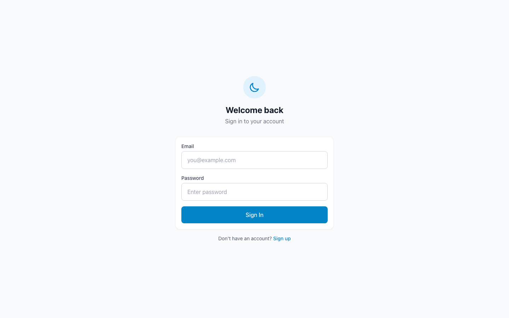
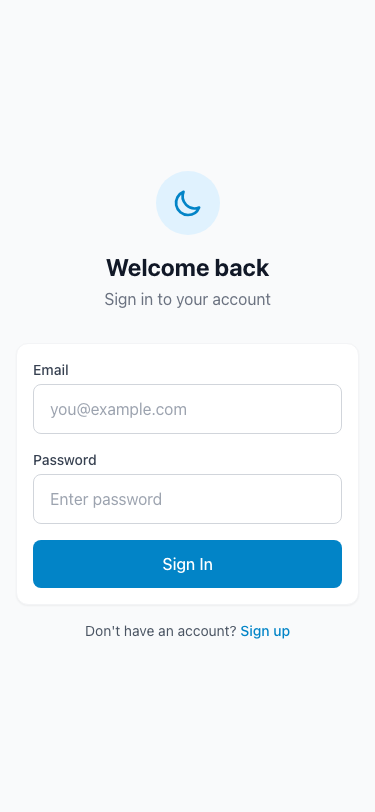
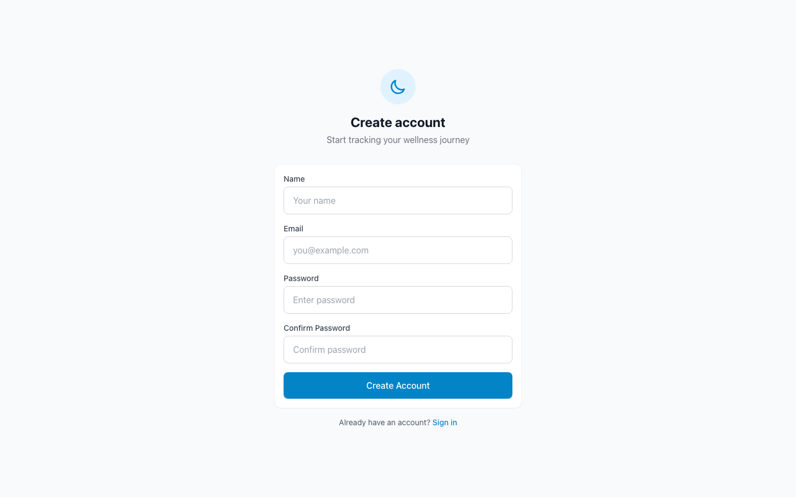
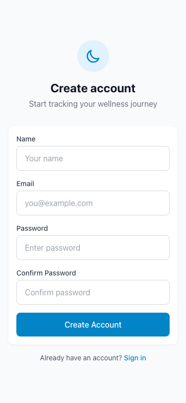
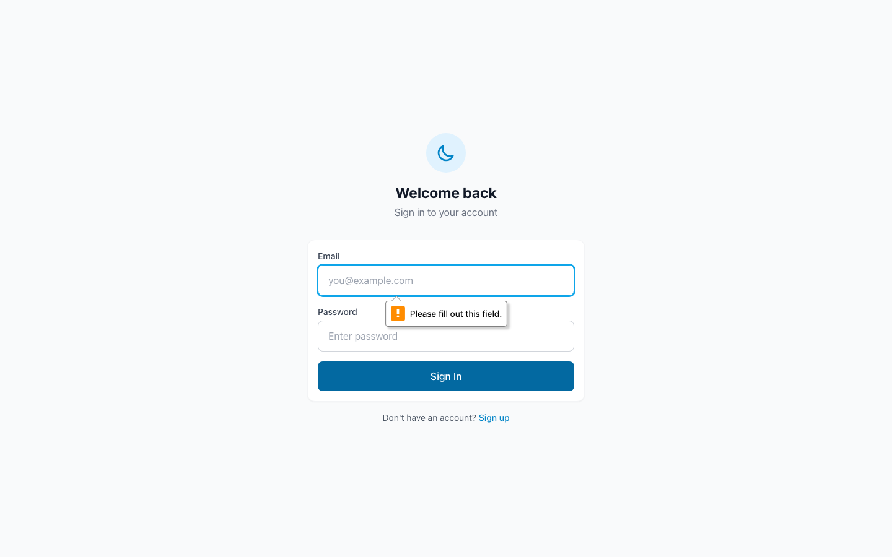

# Visual Report: Sleep Tracker & Wellness Diary

**Date:** 2025-12-09
**Screens Captured:** 5
**Viewports:** Desktop (1440x900), Mobile (375x812)

---

## Capture Index

| # | Filename | Feature | State | Viewport |
|---|----------|---------|-------|----------|
| 1 | `login-desktop-light.png` | Login | Normal | Desktop |
| 2 | `login-mobile-light.png` | Login | Normal | Mobile |
| 3 | `register-desktop-light.png` | Register | Normal | Desktop |
| 4 | `register-mobile-light.png` | Register | Normal | Mobile |
| 5 | `login-error-desktop-light.png` | Login | Error | Desktop |

---

## State Coverage

| Feature | Empty | Normal | Loading | Error | Success |
|---------|-------|--------|---------|-------|---------|
| Login | N/A | ✅ | ❌ | ✅ | ❌ |
| Register | N/A | ✅ | ❌ | ❌ | ❌ |
| Dashboard | ❌ | ❌ | ❌ | ❌ | N/A |
| Sleep Log | ❌ | ❌ | ❌ | ❌ | ❌ |
| Diary | ❌ | ❌ | ❌ | ❌ | ❌ |
| Insights | ❌ | ❌ | ❌ | ❌ | ❌ |
| Settings | ❌ | ❌ | ❌ | ❌ | ❌ |
| History | ❌ | ❌ | ❌ | ❌ | ❌ |

**Note:** Protected pages (Dashboard, Sleep Log, Diary, Insights, Settings, History) require authentication to capture. Public pages (Login, Register) were successfully captured.

---

## Viewport Coverage

| Feature | Mobile | Desktop |
|---------|--------|---------|
| Login | ✅ | ✅ |
| Register | ✅ | ✅ |
| Dashboard | ❌ | ❌ |
| Sleep Log | ❌ | ❌ |
| Diary | ❌ | ❌ |
| Insights | ❌ | ❌ |
| Settings | ❌ | ❌ |
| History | ❌ | ❌ |

---

## Visual Observations

### Positive Observations

1. **Clean, Modern Design** — The login and register pages feature a clean, minimalist design with good use of whitespace
2. **Consistent Branding** — Moon icon used throughout for sleep tracking theme
3. **Responsive Layout** — Forms adapt well between desktop and mobile viewports
4. **Clear Call-to-Action** — Primary buttons (Sign In, Create Account) are prominently styled in blue
5. **Good Form Design** — Labels, placeholders, and input fields are well-organized
6. **Navigation Links** — Clear links between Login and Register pages ("Don't have an account? Sign up")

### Design Elements

| Element | Description |
|---------|-------------|
| **Primary Color** | Blue (#0ea5e9 / Tailwind sky-500) |
| **Background** | Light gray (#f9fafb / Tailwind gray-50) |
| **Card Style** | White background with subtle shadow |
| **Typography** | Clean sans-serif, good hierarchy |
| **Icons** | Moon icon for branding, SVG-based |

### Issues Found

| # | Screenshot | Issue | Severity | Description |
|---|------------|-------|----------|-------------|
| 1 | `login-error-desktop-light.png` | Missing Error State | Low | Error message not visible in screenshot (API returned 500, not form validation error) |

---

## Screenshot Gallery

### Login Page

| Desktop | Mobile |
|---------|--------|
|  |  |

**Features:**
- Email input with placeholder "you@example.com"
- Password input with placeholder "Enter password"
- Sign In button (primary action)
- Link to registration page

### Register Page

| Desktop | Mobile |
|---------|--------|
|  |  |

**Features:**
- Name input
- Email input
- Password input with "At least 8 characters" hint
- Confirm Password input
- Create Account button
- Link to login page

### Error States

| Login Error |
|-------------|
|  |

---

## Technical Notes

### Bug Fixes Applied During Capture

1. **Register.tsx & Login.tsx** — Fixed malformed placeholder strings (`""""""""""` → `"Enter password"`)
2. **useAuth.ts → useAuth.tsx** — Renamed file to support JSX syntax in AuthProvider component
3. **Header.tsx** — Added missing `PageHeader` export used by other pages

### Server Configuration

- **Frontend:** Vite dev server on `http://localhost:5173`
- **Backend:** Express server (had import errors for `loginSchema` from shared module)

---

## Recommendations

### Immediate
- [ ] Fix server-side authentication to enable capturing protected pages
- [ ] Capture error state with actual form validation (client-side)

### Future
- [ ] Add loading state captures for all features
- [ ] Capture tablet viewport (768x1024) for all screens
- [ ] Capture dark mode variants (if implemented)
- [ ] Set up automated visual regression testing with Playwright
- [ ] Capture authenticated user flows (Dashboard, Sleep Log, Diary, etc.)

---

## Files Generated

```
.context-foundry/screenshots/
├── login-desktop-light.png      (28.5 KB)
├── login-mobile-light.png       (23.5 KB)
├── login-error-desktop-light.png (28.6 KB)
├── register-desktop-light.png   (40.1 KB)
├── register-mobile-light.png    (33.7 KB)
└── manifest.txt
```

---

*Generated by Screenshot Agent*
